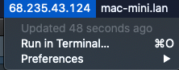
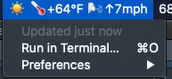

Via the [Automators Podcast](https://www.relay.fm/automators/58) I learned about a little utility which one can use to take any script written in shell, Ruby, Python, etc. and output the results as a Mac menu bar item.  

The tool is called [Bitbar](https://github.com/matryer/bitbar), and it can be downloaded quickly in [Homebrew](https://brew.sh) with  
`~$ brew cask install bitbar` 

But why...?  With the power of scripting, you can put *literally anything* into your menu bar, assuming you can write a script to grab that data.

### Setup
Once bitbar is installed via homebrew, the only configuration is to point it at a folder of scripts which you'd like to use.  Be sure all the script files have executable permissions or you'll get an error.  
`chmod +x my-script.sh`

### Examples
There are a metric crap-ton of "plugins" that folks have written, which are compiled in a repo here.  [https://github.com/matryer/bitbar-plugins](https://github.com/matryer/bitbar-plugins).  It even includes information on [writing your own](https://github.com/matryer/bitbar#writing-plugins)

Here are a few simple ones I whipped up already.  

Get your external IP (note the "silent" flag or you'll get some response codes too)
```
#!/bin/bash
curl --silent wtfismyip.com/text
```
  

Weather, using [wttr.in](http://wttr.in)  
```
#!/bin/bash
curl --silent wttr.in/?format=2
```
