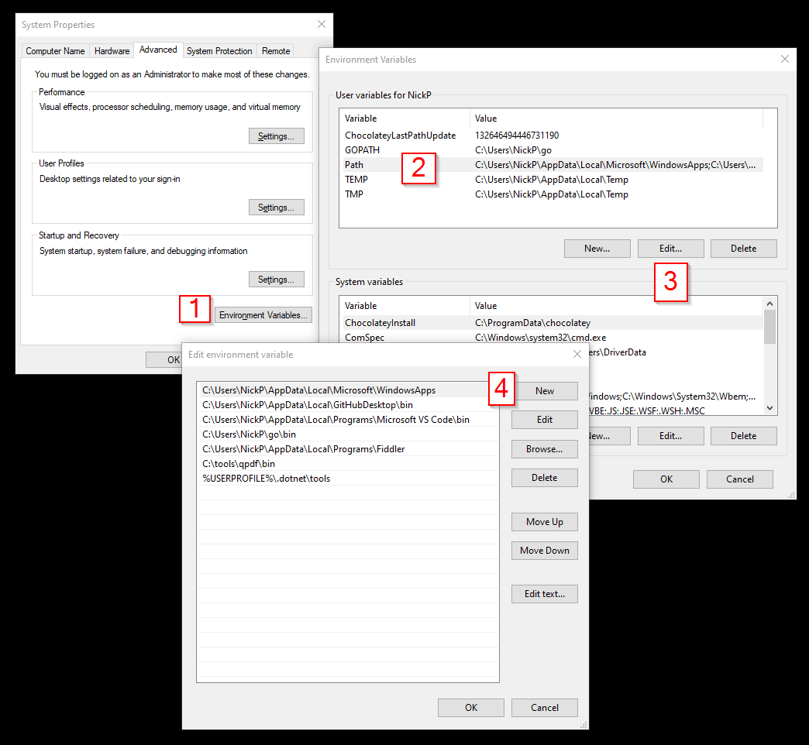

I discovered a wonderful little utilty while trying to debug some encrypted PDF issues at work.  With this you can dig into the encryption/metadata, remove passwords, reorder PDF pages, merge and split PDFs, and more!  All from the cmd line!  Don't be afraid of a little temrinal...

## Install
Go download the correct binary for your OS [here](https://github.com/qpdf/qpdf/releases).  On Windows you'll want the mingw64.zip, other information is [here](https://github.com/qpdf/qpdf/blob/release-qpdf-10.3.2/README-what-to-download.md).

Unzip it, then place the download somewhere safe.  I like to put all these little tools in `C:\tools`.

To make your life easier, place the folder in your $PATH.  This allows the cmd shell (or powershell) to automagically find the executable without needing to specify the entire path.

- Press "start" and search for "edit the system environment variables".  It should come up.
- Click on "Environment Variables" in the system properties pop up
- In the User variables editor, highight "Path" then click "edit"
- Click "New" and add the path to the /bin folder for your qpdf folder, for example `C:\tools\qpdf\bin`.

## Use it
Great!  Fire up a Powershell terminal and cd into some directory where you've got some PDFs.

Use `qpdf --help` to see all available options.

Extract pages 1-3, 5 and 6-10 from a PDF file and save them as another one:  
`qpdf --empty --pages input.pdf 1-3,5,6-10 -- output.pdf`

Merge all  pages of multiple PDFs:  
`qpdf --empty --pages file1.pdf file2.pdf file3.pdf -- output.pdf`

Merge specific pages from multiple PDF files:  
`qpdf --empty --pages file1.pdf 1,6-8 file2.pdf 3,4,5 -- output.pdf`

## Debugging Encryption and Stuff
Two commands that were particularly useful to me...

Check the PDF file contents/metadata  
`qpdf input.pdf --check`

Show encryption details  
`qpdf input.pdf --show-encryption --password=password123`

## Errors
Help, I'm seeing "the term qpdf is not recognized as the name of a cmdlet, function"...

Yea, you screwed up the $PATH thing.  Go check that configuration and do some Googling about Windows PATH variable.